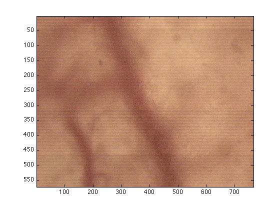
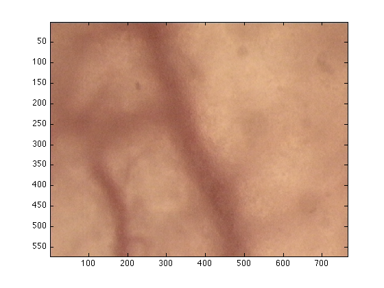
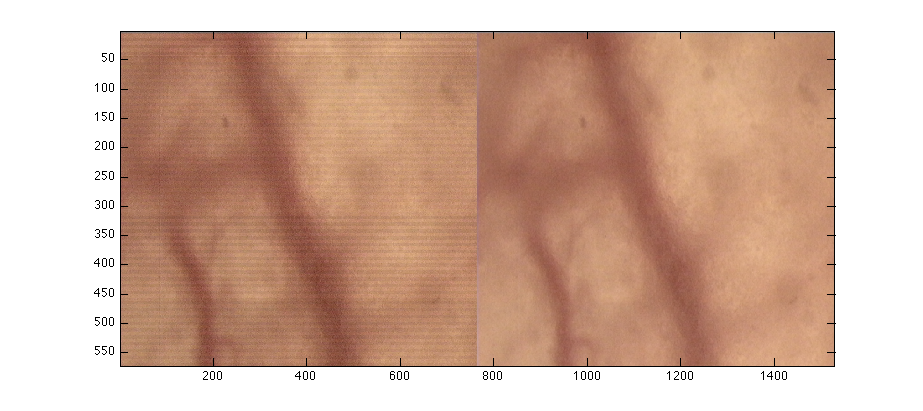

# removeLineArtefact

<h1>User Manual for removeLineArtifact</h1><!--introduction--><!--/introduction-->
          
<h2>Contents</h2>

<ul>
                  <li><a href="#3">Citation</a></li>
                  <li><a href="#1">Introduction</a></li>
                  <li><a href="#2">Loading the data into Matlab</a></li>
                  <li><a href="#7">Saving</a></li>
</ul>

<h2>Citation</h2>

If you find this function useful and publish something with it, please cite it as 

  Henry, KM, Pase, L, Ramos-Lopez, CF, Lieschke, GJ, Renshaw, SA and Reyes-Aldasoro, CC, "Phagosight: An Open-Source MATLAB® Package for the Analysis of Fluorescent Neutrophil and Macrophage Migration in a Zebrafish Model", PLoS ONE 8(8): e72636.
  <a href="http://www.plosone.org/article/info%3Adoi%2F10.1371%2Fjournal.pone.0072636">
  doi:10.1371/journal.pone.0072636</a>
 

 

          
<h2>Introduction</h2>

Images from the "new" microscope had, in some cases, some line
artefacts, that is, they showed different intensities in some lines, not
present in the original sample. This algorithm removes those lines.

<h2>Loading the data into Matlab</h2>

As always, you need to load the data into matlab, either by using imread or drag-and-drop. Refer to other manuals for more details. In this case, I will load them using imread:

<pre class="codeinput">dataIn=imread('ImageWithLineArtif.tiff');
</pre>

Once you have the image, simply run this command:

<pre class="codeinput">dataOut = removeLineArtifact(dataIn);
</pre>

To compare the two images you can visualise them with:

<pre class="codeinput">figure(1)
imagesc(dataIn(:,:,1:3))

figure(2)
imagesc(dataOut)
</pre>

 

 

To make the differences more evident you can plot the images together:

<pre class="codeinput">figure(3)
imagesc([dataIn(:,:,1:3) dataOut])
</pre>

 

In the previous cases, dataIn has been restricted to 3 levels (:,:,1:3) as some tiff files use a fourth dimension.
<h2>Saving</h2>

To save your image, you can simply click on the "edit" menu from the figure, the go to "copy" and then you can "paste" it in word, powerpoint, ... You can also click on "File" then "Save" and select the name (e.g. "myFabulousImage.jpg") and the format (jpg,tif,bmp,...) you prefer.

<pre class="codeinput">%or save it as a matlab file in the following way:

save myFabuolusImage dataOut
</pre>

This last file will save the data of "dataOut" inside the file myFabulousImage. You can save more things there, for instance
<pre class="codeinput">save myFabuolusImage 

dataOut dataIn
</pre>

will save all the dataIn and dataOut.

